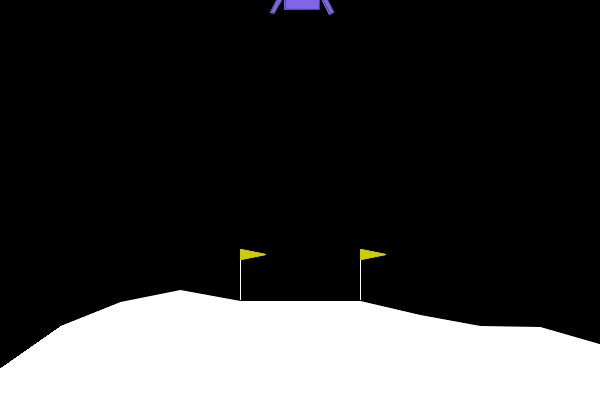
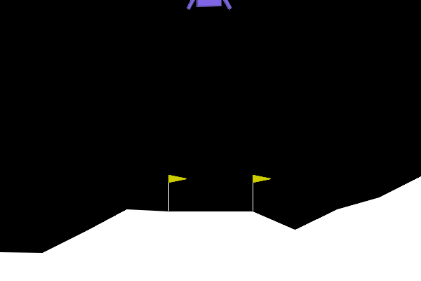
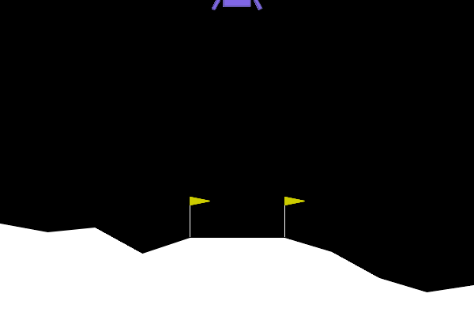
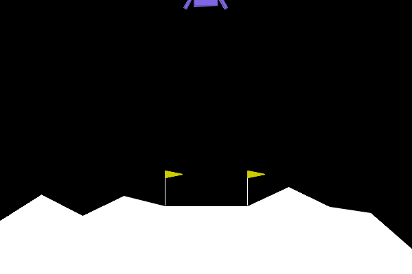
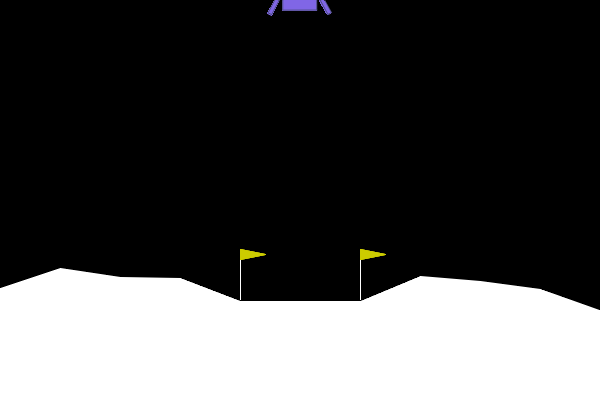
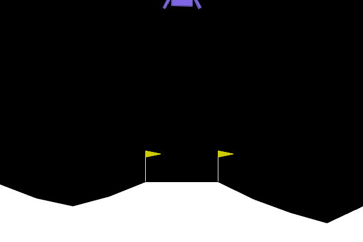
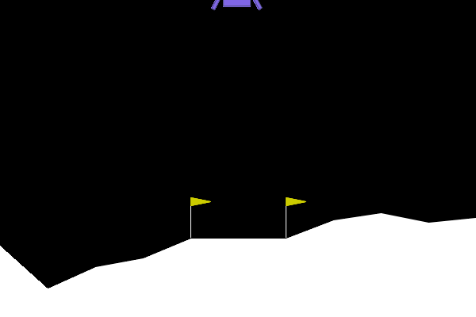
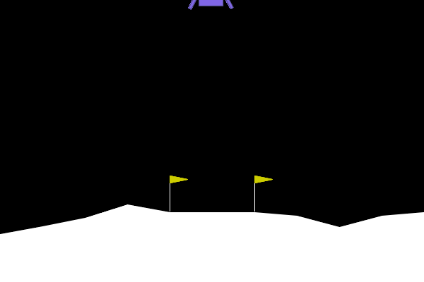
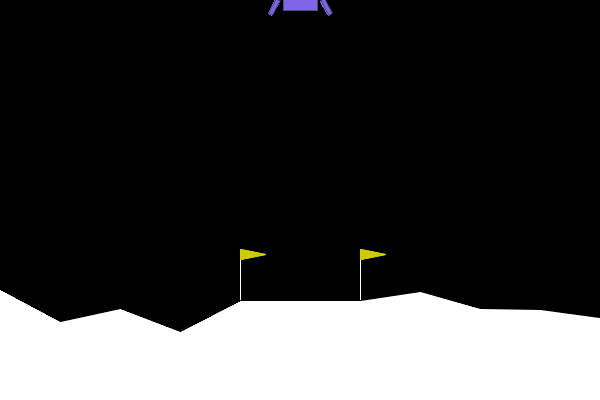
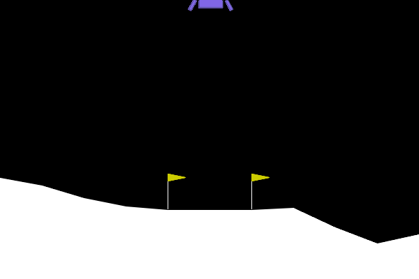

# Deep Reinforcement Learning for Lunar Lander Continuous Control

This project trains a LunarLanderContinuous-v3 agent using Deep Reinforcement Learning. The goal is to land the lunar lander safely between two flags by controlling the main engine and side engines.

Two algorithms were compared:

- PPO (Proximal Policy Optimization)
- SAC (Soft Actor-Critic)

## Environment

The environment used was `LunarLanderContinuous-v3` from Gymnasium.

### Key Features
- Continuous action space
- Physics-based simulation
- Main engine and side engine control
- Landing target between two flags
- Rewards and penalties based on landing behavior

## Technologies Used
- Python
- Google Colab
- Gymnasium
- Stable-Baselines3
- PPO
- SAC
- NumPy
- Matplotlib
- ImageIO

## Observation and Action Space
The agent receives 8 observations:
- x and y position
- horizontal and vertical velocity
- lander angle
- angular velocity
- left leg contact
- right leg contact

The agent controls 2 continuous actions:
- main engine
- side engine

## PPO Implementation
PPO was first used as a baseline algorithm.
### Baseline PPO
- Policy: MlpPolicy
- Total timesteps: 400,000
- Default Stable-Baselines3 settings
- No custom reward shaping

### Improved PPO
Improved PPO was created because baseline PPO was unstable.
Changes added:
- reward shaping
- 4 vectorized environments
- tuned hyperparameters
- staged training at 100K, 200K, and 400K timesteps

### Improved PPO Parameters

| Parameter | Value |
|---|---|
| Learning rate | 2.5e-4 |
| n_steps | 2048 |
| Batch size | 64 |
| Gamma | 0.99 |
| GAE lambda | 0.95 |
| Clip range | 0.2 |
| Entropy coefficient | 0.001 |
| VF coefficient | 0.5 |
| Max grad norm | 0.5 |

### PPO Result
- Baseline PPO reward: 63.60
- Improved PPO reward: 832.82

Improved PPO performed better than baseline, but still showed some instability and hovering behavior.

## SAC Implementation

SAC was used after PPO because it is stronger for continuous control tasks.

SAC is off-policy and uses a replay buffer, which allows it to reuse past experiences during training.

### SAC Parameters

| Parameter | Value |
|---|---|
| Policy | MlpPolicy |
| Total timesteps | 600,000 |
| Learning rate | 3e-4 |
| Replay buffer size | 300,000 |
| Learning starts | 10,000 |
| Batch size | 256 |
| Tau | 0.005 |
| Gamma | 0.99 |
| Train frequency | 1 |
| Gradient steps | 1 |
| Entropy coefficient | auto |

### SAC Result

- Mean reward: 15240.90
- Standard deviation: 8544.28

SAC achieved better shaped reward and smoother control than PPO.

## Reward Shaping

Reward shaping was added to guide the agent toward safer landing.

The reward function penalized:

- high speed
- bad angle
- excessive engine use
- hovering
- crashing

It rewarded:

- controlled descent
- moving toward the landing pad
- leg contact
- stable landing behavior

## PPO vs SAC Comparison

| Factor | PPO | SAC |
|---|---|---|
| Learning type | On-policy | Off-policy |
| Experience reuse | Low | High |
| Replay buffer | No | Yes |
| Batch size | 64 | 256 |
| Training steps | 400,000 | 600,000 |
| Continuous control | Good but unstable | Better and smoother |

## Conclusion

This project compared PPO and SAC on the LunarLanderContinuous-v3 environment.

PPO worked as a useful baseline and improved after reward shaping, but it still struggled with stable landing.

SAC performed better because it reused past experience through a replay buffer and handled continuous actions more effectively.

The final result shows strong partial convergence, but not perfect success. Some hovering and tilted landing behavior still remained.

## Future Work

- Train for more timesteps
- Tune reward shaping further
- Evaluate raw Gymnasium reward separately
- Run multiple random seeds
- Compare with TD3
